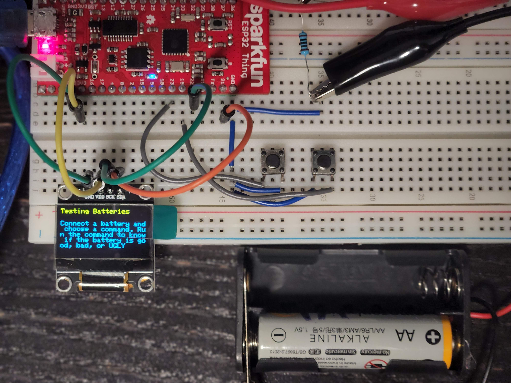
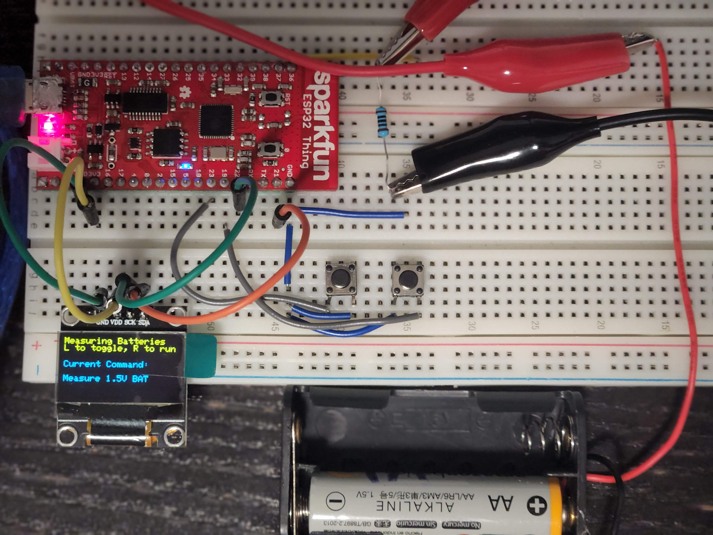
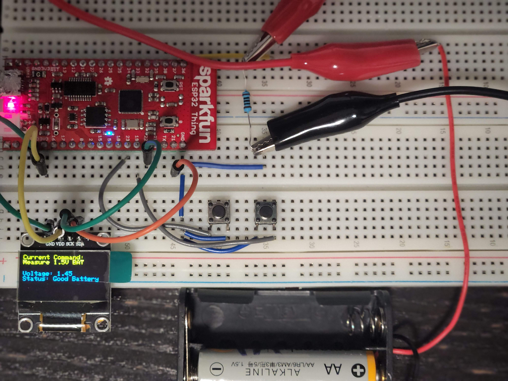

# Battery Tester

You are at a family dinner. One of your relative's children asks you to help her find batteries for her toy robot. You keep trying batteries, but they are all dead. How do you find the good ones?

## Inspiration

You are at a family dinner and one of your relative's children asks you to help her get her toy robot working. You go to your garage (or weird cupboard in the corner of the house) to find batteries. There you find a bunch of batteries thrown in a shoebox. You pick eight good looking batteries, but the robot won't start. You start systematically trying different combinations of eight batteries, but you don't know which one is bad.

You feel frustrated, yet driven to get the robot working. Finally, you succeed; only to realize you spent 15 minutes of your life looking for batteries. The worst thing is this happened last year too.

## What it does

This is a tool to test whether disposable batteries have a charge in them or not. A battery can be good, bad, or ugly. Bad batteries are batteries which can handle weak loads like a remote controller but can no longer handle loads like a toy car.

This allows you to:
- Never throw away a good battery (we don't want to overconsume or pollute the environment)
- Exploit those bad batteries to their last remaining charge to save money and batteries
- Never waste your time with an ugly battery

This project helps you save the environment and your money by allowing you to minimize your consumption of batteries. It also allows you to save time and avoid needless frustrations in family gatherings.

## Demo

Here is a short demo of the main usecase. I will explain in more details using images below.

On startup, the microcontroller displays an explanation of the tool.

Then, the microcontroller displays main menu. If the user clicks the left button (**L**), the user can toggle between different commands. One command would be to update the list of batteries by loading data from the web and the rest of the commands will be to test for different batteries like 9V and AAA batteries. Right now, only the command to test for 1.5V batteries is implemented.

Once the user chooses a command using the left button, the user can use the right button (**R**) to execute that command. For the command to measure 1.5V batteries, the microcontroller will display the voltage while the battery is supplying current to a load (a 100 ohm resistor). This is a more accurate representation of the battery charge than the open circuit voltage. The microcontroller uses this voltage to determine if the battery is good, bad, or ugly.

Finally, the microcontroller goes back to the main menu.

## How I built it

I used the ESP32 microcontroller and coded it using the Arduino framework. I used Visual Studio Code with Platform.io for my development environment. I used git and Github for source control and cloud hosting of my code, respectively.

I considered and tried a few attempts at measuring the charge in the battery and settled on measuring the voltage while the battery is driving a load. This is more accurate than simply measuring voltage.

## Challenges I ran into

I spent too much time measuring and collecting data on how to measure the battery charge. I also got stuck with some package configuration issues for a while because of my development environment setup.

## Accomplishments that I'm proud of

I managed to build a prototype on time even though it doesn't have all the features I want. I built the prototype so I can add a feature to download battery profiles from the web in the future. This will allow me to add support to new batteries on the fly.

## What I learned

- It has been a long time since I last used a microcontroller, so I am happy I got to use one again.
- I learned multiple ways of measuring the charge in a battery.
- I learned not to worry too much about data accuracy and start building even if I don't have the perfect approach in mind yet.

## What's next for Battery Tester

I want to add a feature which will allow the ESP32 to download battery profiles from Github. This will allow the Battery Tester to get updates and support more batteries simply by editing a file on Github.

Then I want to add support to more batteries like:
- 9V batteries
- AAA batteries
- D batteries
- C batteries
- Cell Batteries

If I were to continue working on this project after this, then my following steps would be:
- Optimize the Battery Tester so it wastes as little energy from the battery as possible
- Power the Battery Tester with a rechargeable battery for more convenient use
- Optimize the power consumption of the Battery Tester
- Package the battery tester nicely
- Sell it for $10 a piece -- I think some people might find a use for it just like people use stud finders